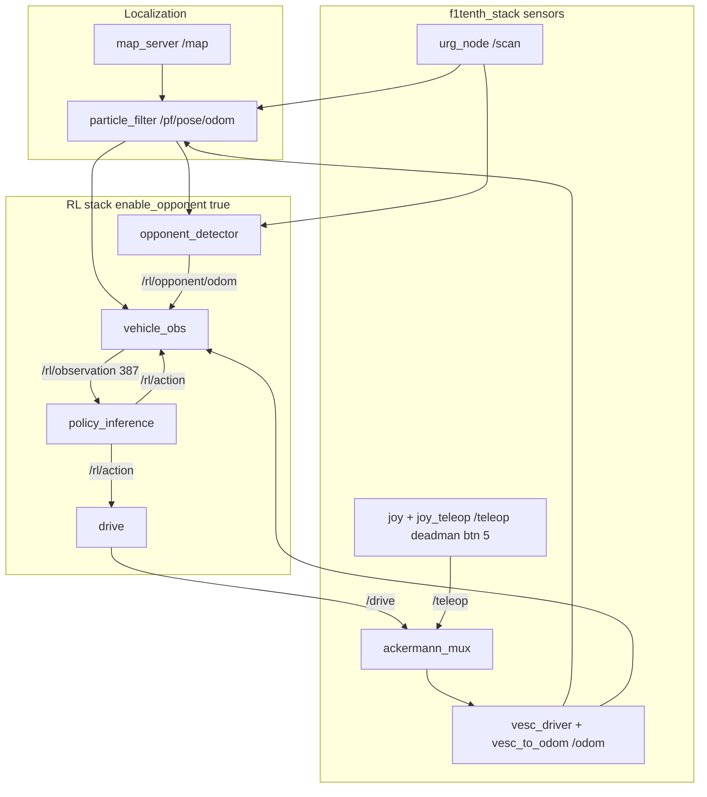

# Real-World 1v1 RL Deployment Plan

Deploy the trained **387-dim 1v1 policy** (`iv2026_1v1_500k_v1/ckpt_500000.pt`) as the ego car on the physical F1TENTH platform, using the **surveyed real track** (`~/maps/f1tenth_map` on the car) and LiDAR-based opponent perception.

**Checkpoint (local main repo, not worktree):**

```
/Users/ZZ29VV/projects/F1tenth-Genesis/outputs/standalone/iv2026_1v1_500k_v1/ckpt_500000.pt
```

**Python venv for local validation:**

```
/Users/ZZ29VV/projects/F1tenth-Genesis/venv/bin/python
```

**Centerline (worktree, post-processed from the real map):**

```
ros2_mapping/output/real_map/clean/f1tenth_map_centerline.csv
ros2_mapping/output/real_map/clean/f1tenth_map.yaml
ros2_mapping/output/real_map/clean/f1tenth_map.png
```

Columns: `x_m, y_m, w_tr_right_m, w_tr_left_m` — same schema as sim (`f1tenth_env/utils.py` lines 143–146).

---

## Remote car status (2026-06-22 probe)

| Item | Status |
|------|--------|
| SSH `shereef@f1tenth` | **Reachable** (hostname `ubuntu`) |
| ROS 2 runtime | **Idle** — only `/rosout` and `/parameter_events` (no stack running) |
| Saved map on car | `~/maps/f1tenth_map.pgm` + `f1tenth_map.yaml` (origin `[28, -11.5, 0]`, resolution `0.05`) |
| Deploy packages installed | `f1tenth_rl_agent`, `f1tenth_rl_vehicle`, `f1tenth_mapping` in `~/f1tenth_ws/install/` |
| Real centerline on car | **Not yet deployed** — only sim assets (`IV_2026_SIM_centerline.csv`) present |

Sections marked **needs car online to confirm** require a live stack on the car.

---

## 1. Observation parity (380 + 7)

### 1.1 Critical fact: no LiDAR in the base policy observation

The policy does **not** consume raw `/scan` beams. The 380-dim base observation is built entirely from **pose + twist + centerline geometry + last action**. LiDAR is used only for **opponent detection** in 1v1 (see §3).

Training assembly order (`f1tenth_env/observations.py` lines 237–264, `build_observation`):

| Index | Dims | Field | Units / frame | Sim source | Real-car source | Parity status |
|-------|------|-------|---------------|------------|-----------------|---------------|
| `[0:2]` | 2 | Body linear velocity `(vx, vy)` | m/s, **body frame** | `base_lin_vel[:, :2]` × `obs_scales.lin_vel` (1.0) | VESC `/odom` twist (`vehicle_obs`, `twist_topic`) | **Match** if `twist_in_world_frame: false` (default) |
| `[2:3]` | 1 | Yaw rate `wz` | rad/s, body | `base_ang_vel[:, 2:3]` × 1.0 | `/odom` `twist.angular.z` | **Match** |
| `[3:5]` | 2 | Body linear accel `(ax, ay)` | m/s², body | Finite diff of body vel | Fixed-step FD at 10 Hz control rate (`vehicle_obs_node.cpp` lines 171–178) | **Match** (method differs from sim per-callback FD in Python builder, but both at 0.1 s) |
| `[5:7]` | 2 | Last action `[throttle, steer]` | [-1, 1] | `last_actions` | Echo of `/rl/action` | **Match** |
| `[7:9]` | 2 | Track progress `[cos(2πs/L), sin(2πs/L)]` | unitless | Frenet `s/L` | Same Frenet math in `rl_obs_core` / `obs_core` | **Match** if centerline aligned to `map` frame |
| `[9]` | 1 | Centerline heading error | rad, wrapped | `yaw - atan2(seg_dir)` | Same | **Match** if pose accurate |
| `[10]` | 1 | Lateral offset `ey` | m, signed | Frenet boundary | Same | **Match** — primary alignment diagnostic |
| `[11]` | 1 | Contact flag | 0/1 | `boundary_dist < 0.08` | Same (`contact_margin_m: 0.08`) | **Match** |
| `[12:372]` | 360 | Future track points | m, **ego frame** | 60 samples × 3 curves (center/left/right) × 2D | Same params: `future_track_num_points=60`, `horizon_s=6.0`, `min_lookahead_m=5.0` | **Match** if CSV widths used (not deprecated `future_track_width`) |
| `[372:380]` | 8 | Tyre slip `[slip_ratio×4, slip_angle×4]` | — | `compute_tyre_slip` in sim | **Zeros on car** (`vehicle_obs_node.cpp` lines 9–11, 194) | **Intentional gap** — same as gym deploy; policy trained with zeros here |
| `[380:387]` | 7 | Opponent block | see §1.2 | `obs_opponent()` | LiDAR detector → `/rl/opponent/odom` → `vehicle_obs` | **Hard part** — see §3 |

Layout is frozen in `ros2_deploy/f1tenth_rl_agent/f1tenth_rl_agent/interfaces.py` lines 40–51 and documented in `ros2_deploy/INTERFACES.md` lines 50–78.

**Total:** 380 base + 7 opponent = **387**. Checkpoint actor input layer is `[512, 387]`; `obs_norm.mean/var` shape `[387]`.

### 1.2 Opponent block layout (training = deploy)

From `f1tenth_env/observations.py` lines 149–215 (`obs_opponent`):

| Index | Field | Definition |
|-------|-------|------------|
| `[380:382]` | `rel_x, rel_y` | Opponent position minus ego, rotated into **ego body frame** (m) |
| `[382:384]` | `rel_vx, rel_vy` | Opponent velocity minus ego, rotated into **ego body frame** (m/s) |
| `[384]` | `gap_norm` | `(s_opp - s_ego)` wrapped to `[-L/2, L/2]`, divided by `L/2` → ∈ [-1, 1] |
| `[385]` | `ey_opp` | Opponent signed lateral offset from centerline (m) |
| `[386]` | `present` | 1.0 if opponent present, else 0.0 |

When absent, the **entire 7-dim block is zero** (including the presence flag) — the exact 1v0 sentinel (`observations.py` lines 213–215).

C++ and Python deploy ports match this exactly (`obs_core.py` lines 304–351, `rl_obs_core.hpp` lines 35–38).

### 1.3 Observation normalization (`obs_norm`) — mandatory at deploy

Training keeps env-side scales at 1.0 (`config.py` lines 40–47) and standardizes with a running `ObsNormalizer` (mean/var in checkpoint).

At inference, `policy_inference_node.py` (lines 100–126, 135–136):

1. Load `obs_norm` from checkpoint (`{"mean", "var", "count"}`).
2. Apply `(obs - mean) / sqrt(var + eps)`, clamp to `[-norm_clip, norm_clip]`.
3. Defaults: `norm_clip=10.0`, `norm_eps=1e-8` (`config.py` lines 52–53, `interfaces.py` lines 65–66).

**Gap if skipped:** policy sees raw obs → immediate erratic driving. Verify log line: `Loaded obs_norm (clip=10.0, ...)`.

**Gap if wrong dim:** 1v1 checkpoint expects 387-dim raw obs before norm. Loading a 380-dim obs into a 387-input actor fails at load time; feeding 380-dim messages at runtime causes skip warnings (`policy_inference_node.py` lines 129–132).

### 1.4 Config constants that must match training

From `config.py` DEFAULT_CONFIG:

| Parameter | Value | Deploy location |
|-----------|-------|-----------------|
| `num_obs` | 380 (+7 for 1v1) | `interfaces.py`, `vehicle.yaml` |
| `control_interval` × `sim_dt` | 20 × 0.005 = **0.1 s → 10 Hz** | `vehicle_obs.control_hz: 10.0` |
| `clip_actions` | 1.0 | `drive.clip_actions`, `policy_inference` clip |
| `max_speed` | 15.0 m/s | `drive.max_speed` (cap separately via `speed_limit_mps`) |
| `delta_max` / `max_steer` | 0.44 rad | `drive.max_steer` |
| `clip_obs` | 50.0 | `vehicle_obs.clip_obs` |
| `contact_margin_m` | 0.08 | `vehicle_obs.contact_margin_m` |
| `future_track_num_points` | 60 | `vehicle_obs` |
| `future_track_horizon_s` | 6.0 | `vehicle_obs` |
| `future_track_min_lookahead_m` | 5.0 | `vehicle.yaml` line 21 |
| `enable_opponent_obs` | **true for 1v1** | launch `enable_opponent:=true` |

### 1.5 Deploy-side parity tooling (already exists)

| Test | What it proves |
|------|----------------|
| `ros2_deploy/f1tenth_rl_agent/test/test_obs_parity.py` | Python `obs_core` ≡ sim `build_observation` (< 1e-4) |
| `ros2_deploy/f1tenth_rl_vehicle/test/test_rl_obs_core.cpp` | C++ `rl_obs_core` ≡ Python fixture |
| `validate_opponent_obs_gym.py` | Opponent block vs sim ground truth in gym |

Run locally before car day:

```bash
cd /Users/ZZ29VV/projects/F1tenth-Genesis/ros2_deploy/f1tenth_rl_agent
/Users/ZZ29VV/projects/F1tenth-Genesis/venv/bin/python -m pytest test/test_obs_parity.py -q
```

Regenerate C++ fixture after changing real centerline:

```bash
cd ros2_deploy/f1tenth_rl_vehicle/test
PYTHONPATH=../../f1tenth_rl_agent python gen_obs_fixture.py \
  /path/to/f1tenth_map_centerline.csv obs_fixture.txt
```

### 1.6 Parity gaps summary

| Gap | Severity | Mitigation |
|-----|----------|------------|
| Centerline CSV not in `map` frame | **Blocker** | Align via `vehicle_calibration/track_align.py` or manual start-pose check (§2) |
| PF localization drift vs sim ground truth | **High** | Tune PF; verify `obs[10]` ≈ 0 at known pose; bag and compare |
| Tyre slip always zero | **Low** (by design) | Same as gym deploy; policy never saw real slip |
| Opponent block from noisy LiDAR | **High for 1v1** | Tune detector; fallback strategies in §3 |
| `twist_in_world_frame` mismatch | **Medium** | Keep `false` for VESC odom (body frame) |
| Sim friction (carpet params) vs real carpet | **High** | Parallel sim friction work; start with low `speed_limit_mps` |

---

## 2. Localization

The RL stack expects a **map-frame pose** on `/pf/pose/odom` plus body twist on `/odom` (`vehicle.yaml` lines 10–12). Frenet features are computed in the **same frame as the centerline CSV** (typically `map`).

### 2.1 Recommended: particle filter + map_server (already wired)

Use `iv2026_localize_launch.py` on the car (particle filter, not legacy levine map):

```bash
# On car (after sensors running — see §5)
source /opt/ros/humble/setup.bash
source ~/f1tenth_ws/install/setup.bash

ros2 launch f1tenth_stack iv2026_localize_launch.py \
  map_yaml:=/home/shereef/maps/f1tenth_map.yaml
```

This starts:

- `nav2_map_server` → publishes `/map` from **`f1tenth_map.yaml`**
- `particle_filter` → consumes `/scan` + `/odom`, publishes **`/pf/pose/odom`** (map-frame pose)

PF config: `~/f1tenth_ws/src/f1tenth_system/f1tenth_stack/config/iv2026_pf.yaml` (`scan_topic: /scan`, `odometry_topic: /odom`, `publish_odom: 1`).

**Needs car online to confirm:** exact published topic name for PF odometry (expected `/pf/pose/odom` per deploy defaults).

### 2.2 Alternative: slam_toolbox localization mode

`iv2026_localization.yaml` on the car is preconfigured for `mode: localization` but still points at **`map_file_name: IV_2026`** (sim production map), **not** `f1tenth_map`. Do **not** use as-is.

To use slam_toolbox against the surveyed map:

1. Copy `f1tenth_map.pgm/.yaml` to a slam-readable path (already at `~/maps/`).
2. Create `f1tenth_localization.yaml` (fork of `iv2026_localization.yaml`):
   - `mode: localization`
   - `map_file_name: /home/shereef/maps/f1tenth_map` (no extension)
   - `map_start_pose: [x, y, yaw]` — set after first manual alignment
   - `do_loop_closing: false`
3. Launch: `ros2 launch slam_toolbox localization_launch.py slam_params_file:=...`

**Gap vs deploy stack:** slam_toolbox publishes `map→odom` TF; it does **not** publish `/pf/pose/odom`. Options:

- Add a small relay node: `map` pose from TF (`map` ← `odom` ← `base_link`) → `/pf/pose/odom`, **or**
- Change `vehicle_obs` / `opponent_detector` `pose_topic` to an odometry source derived from slam TF.

**Recommendation:** use particle filter for race day — it is what `f1tenth_rl_vehicle` was built and tested against (`ros2_deploy/README.md` lines 164–179).

### 2.3 Map ↔ centerline alignment procedure

The policy's Frenet features are only correct when the PF pose and centerline CSV share one coordinate system (`ros2_deploy/README.md` lines 284–292).

1. Copy centerline to car:
   ```bash
   scp ros2_mapping/output/real_map/clean/f1tenth_map_centerline.csv \
       shereef@f1tenth:~/maps/f1tenth_map_centerline.csv
   ```
2. Place car at a **known** point on track (mark tape on carpet).
3. Start PF + sensors (no RL yet).
4. Manually drive (~0.5 m/s) or nudge car until PF converges.
5. Check alignment:
   - Record `/rl/observation` is not published yet — instead compute offline or add temporary `vehicle_obs` with **`speed_limit` irrelevant**.
   - **Quick check:** at standstill, log PF pose vs nearest centerline point; lateral offset should match visual.
   - **Obs check:** once `vehicle_obs` runs, **`obs[10]`** (lateral error) should be **≈ 0** at the known on-center pose (`interfaces.py` `OBS_CENTERLINE_DISTANCE`).
6. If misaligned: re-run `ros2_mapping/postprocess/process_real_map.py` ensuring the centerline is extracted in **`map` frame** (same origin/resolution as `f1tenth_map.yaml`: origin `[28, -11.5, 0]`, res `0.05`).

Tooling: `vehicle_calibration/track_align.py` (bags `/pf/pose/odom`, compares to CSV).

---

## 3. Opponent perception (1v1 crux)

### 3.1 Training vs real world

In sim, opponent state is **ground truth** from the second car entity (`env.py` lines 976–991: `_ego_opponent_block` uses exact `opp_base_pos`, `opp_vel_world`, Frenet `s`/`ey`).

On the real car, the **`opponent_detector`** node (`opponent_detector_node.cpp`) synthesizes `/rl/opponent/odom`:

1. Subscribe `/scan` (Hokuyo via `urg_node`) + ego pose `/pf/pose/odom`.
2. Transform each beam to **map frame** using static laser mount offset (no tf2).
3. Cluster returns; gate to **drivable corridor** (centerline + `w_tr_*` CSV) to reject walls.
4. Foreground jump gate (`foreground_jump_m: 0.30`) reduces wall false positives.
5. Multi-frame association + velocity smoothing → publish `nav_msgs/Odometry` on **`/rl/opponent/odom`**.
6. `vehicle_obs` consumes this and calls the same `obs_opponent` math as sim.

Measured in gym validation (`ros2_deploy/README.md` lines 257–264):

- ~95% recall when opponent visible in LiDAR FoV
- ~0.5 m mean position error
- ~15% false-positive rate when occluded (down from ~55% with corridor gate alone)

### 3.2 Required configuration

In `vehicle.yaml` (`opponent_detector` section, lines 37–69):

| Param | Default | Action for real track |
|-------|---------|----------------------|
| `track_csv` | (from launch) | `~/maps/f1tenth_map_centerline.csv` |
| `scan_topic` | `/scan` | OK |
| `pose_topic` | `/pf/pose/odom` | OK |
| `lidar_offset_x/y/yaw` | 0 | **Set from URDF/bringup:** static TF in `bringup_nogap_launch.py` line 63 is `[0.27, 0.0, 0.11]` m, yaw 0 → set `lidar_offset_x: 0.27`, `lidar_offset_y: 0.0`, `lidar_offset_yaw: 0.0` |
| `cluster_gap_m` | 0.30 | Tune on car with opponent parked ahead |
| `max_range_m` | 10.0 | OK for F1TENTH scale |
| `min_track_age_frames` | 3 | Increase if spurious detections |

`vehicle_obs.opponent_timeout_s: 0.5` — if no `/rl/opponent/odom` for 0.5 s, opponent block goes to **zero sentinel** (`vehicle_obs_node.cpp` lines 196–206).

### 3.3 Fallback strategies

| Strategy | When | Risk |
|----------|------|------|
| **A. Full 1v1** (`enable_opponent:=true`) | Opponent detector validated on real track | False positives → policy thinks car is beside/overtaking ghost |
| **B. Zero opponent block** | Detector not ready; still load 1v1 ckpt | Policy trained expecting opponent features — may be overly cautious or aggressive vs training distribution |
| **C. 1v0 checkpoint** (`chicane_fix_50k_v1/ckpt_50000.pt`, 380-dim) | Opponent perception blocked | No overtaking behavior; safe solo lap baseline |
| **D. Scripted opponent car** | Second car teleop/autopilot | Could publish ground-truth `/rl/opponent/odom` from second PF — best for 1v1 validation |

**Recommendation:** staged approach — validate detector with **parked opponent** (stationary detection is supported, `README.md` lines 215–216) before full race. Keep **1v0 checkpoint** on car as rollback.

### 3.4 Pre-race detector validation (needs car online)

```bash
# Terminal 1: stack + localization + sensors
# Terminal 2: opponent detector only
ros2 run f1tenth_rl_vehicle opponent_detector --ros-args \
  -p track_csv:=/home/shereef/maps/f1tenth_map_centerline.csv \
  -p scan_topic:=/scan \
  -p pose_topic:=/pf/pose/odom \
  -p lidar_offset_x:=0.27

# Terminal 3: compare to ground truth (manual tape measure / second car odom)
ros2 topic echo /rl/opponent/odom
ros2 topic echo /rl/opponent/marker  # Foxglove sphere
```

---

## 4. Control pipeline

### 4.1 Action semantics (training = deploy)

Sim (`env.py` lines 908–914, 1114–1118):

- `actions[0]` = throttle ∈ [-1, 1] → drive/brake torque
- `actions[1]` = steering ∈ [-1, 1] → `steer * delta_max` (0.44 rad), with steering lag (`t_delta=0.1`)

Deploy mapping (`drive_math.py` lines 12–29, `drive_node.cpp` via `mapActionToDrive`):

```python
speed = max(throttle, 0.0) * max_speed   # brake_behavior: "stop"
steering_angle = steering * max_steer
```

Negative throttle → **stop**, not reverse (matches sim brake semantics).

### 4.2 Real-car drive path

```
policy_inference  →  /rl/action  →  drive (C++)  →  /drive  →  ackermann_mux  →  ackermann_drive  →  VESC
```

Mux priorities (`~/f1tenth_ws/.../mux.yaml` on car):

| Input | Topic | Priority |
|-------|-------|----------|
| safety | `/brake` | 9999 |
| joystick | `/teleop` | **100** |
| navigation (RL) | `/drive` | 10 |

**Deadman:** `joy_teleop.yaml` on car — teleop drive requires **button 5** deadman (`deadman_buttons: [5]`). Hold deadman for manual override; release to pass control to RL `/drive` (still subject to watchdog).

### 4.3 Speed limits and VESC deadband

Mapping lessons (`reactive_explorer_real.yaml` lines 16–19, `reactive_explorer_node.py` line 79):

- VESC has a **low-speed deadband ~0.5 m/s** — commands below this stall the motor in tight turns.
- Mapping used `min_speed_mps: 1.0`, `cruise_speed_mps: 1.8`.
- RL `drive` node has **`speed_limit_mps`** (default **2.0** in `vehicle.yaml` line 78) — independent of `max_speed: 15.0`.

Staged caps:

| Stage | `speed_limit_mps` | Notes |
|-------|-------------------|-------|
| Dry-run | N/A | Don't launch `drive`; or publish zero-speed test |
| Crawl | 1.0–1.5 | Above VESC deadband |
| Medium | 3.0 | ~sim racing line speeds |
| Full | 6.0–15.0 | Only after clean laps |

Watchdog: if `/rl/action` stops for **> 0.5 s**, `drive` publishes **stop** (`drive_node.cpp` lines 81–89).

---

## 5. Node graph and bringup

### 5.1 Target architecture



### 5.2 Launch order (race day)

**Phase 0 — prerequisites on car**

```bash
# Copy artifacts from dev machine
scp /Users/ZZ29VV/projects/F1tenth-Genesis/outputs/standalone/iv2026_1v1_500k_v1/ckpt_500000.pt \
    shereef@f1tenth:~/checkpoints/ckpt_500000.pt

scp ros2_mapping/output/real_map/clean/f1tenth_map_centerline.csv \
    shereef@f1tenth:~/maps/f1tenth_map_centerline.csv
```

**Phase 1 — base stack (sensors + teleop + mux)**

Option A: stock bringup:

```bash
ros2 launch f1tenth_stack bringup_launch.py
```

Option B: mapping-style bringup without gap driver (`ros2_mapping/deploy/bringup_nogap_launch.py`) — same sensors, no stock gap controller competing on `/drive`.

**Phase 2 — localization**

```bash
ros2 launch f1tenth_stack iv2026_localize_launch.py \
  map_yaml:=/home/shereef/maps/f1tenth_map.yaml
```

Wait for PF convergence (drive slowly with deadman, or push car). **Needs car online to confirm.**

**Phase 3 — RL agent (1v1)**

Create `~/f1tenth_ws/rl_real.yaml` (override snippet):

```yaml
vehicle_obs:
  ros__parameters:
    track_csv: "/home/shereef/maps/f1tenth_map_centerline.csv"
    enable_opponent_obs: true

opponent_detector:
  ros__parameters:
    track_csv: "/home/shereef/maps/f1tenth_map_centerline.csv"
    lidar_offset_x: 0.27
    lidar_offset_y: 0.0
    lidar_offset_yaw: 0.0

drive:
  ros__parameters:
    max_speed: 15.0
    max_steer: 0.44
    speed_limit_mps: 2.0   # raise after validation
    brake_behavior: "stop"
```

Launch:

```bash
source /opt/ros/humble/setup.bash
source ~/f1tenth_ws/install/setup.bash

ros2 launch f1tenth_rl_vehicle bringup_vehicle.launch.py \
  params_file:=/home/shereef/f1tenth_ws/rl_real.yaml \
  agent_params_file:=$(ros2 pkg prefix f1tenth_rl_agent)/share/f1tenth_rl_agent/config/agent_1v1_detector.yaml \
  checkpoint_path:=/home/shereef/checkpoints/ckpt_500000.pt \
  track_csv:=/home/shereef/maps/f1tenth_map_centerline.csv \
  enable_opponent:=true
```

Key params wired by this launch (`bringup_vehicle.launch.py` lines 90–136):

- `vehicle_obs` + `opponent_detector` + `policy_inference` + `drive`
- `enable_opponent_obs: true` on both obs builder and policy
- `agent_1v1_detector.yaml` uses `opponent_odom_topic: "/rl/opponent/odom"` (real-car path; sim `agent_1v1.yaml` uses gym `/ego_racecar/opp_odom`)

**Phase 4 — verify topics before moving**

```bash
ros2 topic hz /rl/observation    # expect ~10 Hz, 387 floats
ros2 topic hz /rl/action         # ~10 Hz
ros2 topic echo /rl/observation --once  # len 387, finite
ros2 topic echo /drive --once    # speed 0 until confident
```

### 5.3 What NOT to launch

- `bringup_agent_launch.py` (sim 5-node stack with `track_server` / `evaluation`) — wrong for real car
- `reactive_explorer` / mapping slam — conflicts with localization mode
- Sim `observation_builder` Python node — use C++ `vehicle_obs` instead (lower latency, already installed)

---

## 6. Safety and staged rollout

### 6.1 Layers

1. **Human deadman** (button 5) — instant teleop override at mux priority 100
2. **Physical e-stop** — hardware cutout (operator responsibility)
3. **Software watchdog** — 0.5 s action timeout → zero speed
4. **`speed_limit_mps`** — hard cap in `drive` node
5. **Dry-run** — validate obs/policy without motion

### 6.2 Staged rollout sequence

| Stage | Procedure | Pass criteria |
|-------|-----------|---------------|
| **S0 Dry-run obs** | Launch PF + `vehicle_obs` only (no `drive`, no `policy_inference`) | `/rl/observation` 387-dim, finite; `obs[10]≈0` at known pose |
| **S1 Dry-run policy** | Add `policy_inference`; **do not** launch `drive` | `/rl/action` in [-1,1], reasonable steering at standstill |
| **S2 Zero-speed drive** | Launch `drive` with teleop holding deadman; set `speed_limit_mps: 0.001` or manually intercept — verify mux accepts `/drive` at priority 10 | `/drive` messages arrive; car still (deadman off → RL commands but hold deadman for safety) |
| **S3 Crawl** | `speed_limit_mps: 1.5`, deadman ready | One slow lap, no wall contact; bag recorded |
| **S4 1v1 detect** | Park opponent ahead; `enable_opponent:=true` | `/rl/opponent/odom` stable; `obs[386]==1` when opponent visible |
| **S5 Race speed** | Raise `speed_limit_mps` gradually (2 → 4 → 6 m/s) | Clean laps, overtakes when opponent present |

### 6.3 Bag record (post-run debug)

```bash
ros2 bag record /rl/observation /rl/action /drive /pf/pose/odom /odom /scan /rl/opponent/odom
```

---

## 7. Open questions and blockers

| # | Item | Status / action |
|---|------|---------------|
| 1 | Real centerline CSV on car | **Blocker** — copy from worktree `output/real_map/clean/` |
| 2 | Centerline ↔ `f1tenth_map` frame alignment | **Blocker** — verify `obs[10]` at known pose (needs car online) |
| 3 | PF tuning on real map vs IV_2026 defaults | **Needs car online** — may need `iv2026_pf.yaml` tweaks |
| 4 | Opponent detector tuned on real carpet track | **High risk** — gym metrics may not transfer; budget time for tuning |
| 5 | `lidar_offset_*` exact values | Set from `static_transform_publisher` (0.27, 0, 0.11); verify in Foxglove |
| 6 | Sim friction mismatch (carpet) | Policy trained in Genesis with `tire_friction: 0.65`; real carpet may differ — parallel sim friction calibration |
| 7 | Second opponent car | Required for real 1v1 race — need driver or scripted slow car |
| 8 | `ros2_deploy` lives in main repo | Car has packages installed from `~/F1tenth-Genesis`; ensure car build matches latest commit before race |
| 9 | Checkpoint `obs_norm` for indices `[380:387]` | Confirm opponent block stats are non-trivial (load ckpt locally — mean/var shape `[387]`) |
| 10 | Joy deadman button | Car config shows button **5** for teleop drive deadman — confirm with operator |

---

## 8. Day-of execution checklist

### Before leaving the lab

- [ ] Run `pytest test/test_obs_parity.py` locally
- [ ] Verify checkpoint loads: actor input dim 387, `obs_norm` present
- [ ] `scp` checkpoint + `f1tenth_map_centerline.csv` to car
- [ ] Charge batteries; controller paired; e-stop tested
- [ ] Copy 1v0 fallback checkpoint (`ckpt_50000.pt`, 380-dim) to `~/checkpoints/`

### On car — setup (≈30 min)

- [ ] SSH `shereef@f1tenth`; confirm `~/maps/f1tenth_map.yaml` + centerline CSV present
- [ ] Tear down stale processes: `bash ~/F1tenth-Genesis/ros2_mapping/deploy/run_teardown.sh` (or manual `pkill`)
- [ ] Launch sensor stack (`bringup_launch.py` or `bringup_nogap_launch.py`)
- [ ] Launch PF localization with **`map_yaml:=~/maps/f1tenth_map.yaml`**
- [ ] Confirm topics: `/scan`, `/odom`, `/map`, `/pf/pose/odom` **(needs car online)**
- [ ] Align PF: drive slowly until pose stable; check visual vs map in Foxglove

### Observation validation (≈15 min)

- [ ] Launch `vehicle_obs` alone with real `track_csv`; confirm `/rl/observation` length **387** at 10 Hz
- [ ] At known on-track pose: **`obs[10]`** (lateral error) near zero
- [ ] `obs[372:380]` all zero (tyre slip)
- [ ] Launch `policy_inference` with checkpoint; confirm log: **`Loaded obs_norm`**
- [ ] Inspect `/rl/action` — finite, in [-1, 1]

### Opponent validation (≈20 min, 1v1 only)

- [ ] Place opponent car ~5–7 m ahead on centerline (matches training `opponent_spawn_gap_m: 7.0`)
- [ ] Launch `opponent_detector`; confirm `/rl/opponent/odom` + marker
- [ ] Launch full stack with `enable_opponent:=true`
- [ ] Verify `obs[386] == 1.0` when opponent visible; block goes to zero when occluded > 0.5 s

### First motion (≈30 min)

- [ ] Set `speed_limit_mps: 1.5` in params
- [ ] Operator holds deadman; release briefly for RL control in straight
- [ ] First autonomous crawl lap with deadman ready
- [ ] Bag record enabled
- [ ] If stable: raise speed limit; attempt overtake with opponent

### Rollback triggers

- Immediate stop if: `obs` non-finite, watchdog fires repeatedly, PF diverges, ghost opponent detections cause erratic steering
- Rollback to **1v0 380-dim checkpoint** with `enable_opponent:=false`
- Full stack kill: `run_teardown.sh` + release deadman

---

## Appendix A — Sim vs deploy code map

| Concern | Training (sim) | Real car deploy |
|---------|----------------|-----------------|
| Obs assembly | `f1tenth_env/observations.py` | `f1tenth_rl_vehicle/rl_obs_core.cpp` (+ Python `obs_core.py` for sim) |
| Obs publisher | env internal | `vehicle_obs` node |
| Opponent block | `obs_opponent()` from GT state | `opponent_detector` → `/rl/opponent/odom` → `vehicle_obs` |
| Normalization | Trainer `ObsNormalizer` | `policy_inference` loads `obs_norm` from `.pt` |
| Action → motors | `_apply_actions` force/torque | `drive` → Ackermann → mux → VESC |
| Pose | Sim GT `/ego_racecar/odom` | PF `/pf/pose/odom` |
| Centerline | `IV_2026_SIM` CSV | **`f1tenth_map_centerline.csv`** (surveyed) |

## Appendix B — Key file references

| File | Lines | Content |
|------|-------|---------|
| `f1tenth_env/observations.py` | 149–215, 218–303 | Opponent block + full obs assembly |
| `config.py` | 38–71, 73–98 | obs + env defaults |
| `f1tenth_env/env.py` | 908–914, 976–991 | Action mapping + opponent block wiring |
| `ros2_deploy/.../interfaces.py` | 40–51, 91–117 | Obs index slices + dims |
| `ros2_deploy/.../policy_inference_node.py` | 100–136 | obs_norm application |
| `ros2_deploy/.../vehicle.yaml` | 4–84 | Real-car topics, opponent, speed cap |
| `ros2_deploy/.../bringup_vehicle.launch.py` | 90–136 | 1v1 launch wiring |
| `ros2_mapping/deploy/bringup_nogap_launch.py` | 31–64 | Sensor stack + laser TF |
| `ros2_mapping/deploy/reactive_explorer_real.yaml` | 16–19 | VESC deadband lesson |
